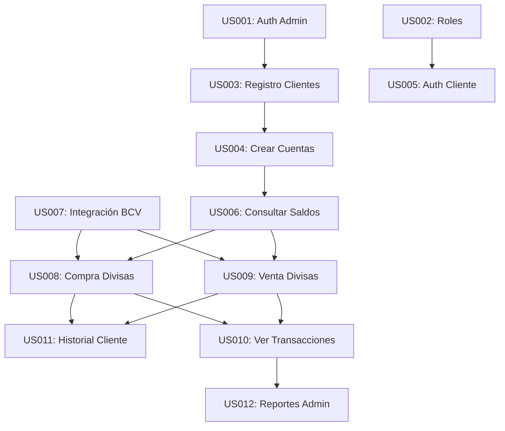

# HISTORIAS DE USUARIO DETALLADAS

## 1. FORMATO ESTÁNDAR

Todas las historias de usuario siguen el formato:
**"Como [tipo de usuario], quiero [funcionalidad], para [beneficio/valor]"**

Cada historia incluye:
- **ID único**
- **Título descriptivo**
- **Descripción en formato estándar**
- **Criterios de aceptación específicos**
- **Estimación en Story Points**
- **Prioridad de negocio**
- **Épica asociada**

## 2. HISTORIAS DE USUARIO POR ÉPICA

### ÉPICA 1: GESTIÓN DE USUARIOS Y AUTENTICACIÓN

#### US001: Autenticación de Administrador
**Como** administrador del sistema bancario  
**Quiero** autenticarme con mis credenciales  
**Para** acceder a las funciones administrativas del sistema de divisas  

**Criterios de Aceptación:**
- **AC1.1:** El sistema debe mostrar un formulario de login con campos email y contraseña
- **AC1.2:** El sistema debe validar las credenciales contra la base de datos
- **AC1.3:** Si las credenciales son correctas, debe redirigir al dashboard administrativo
- **AC1.4:** Si las credenciales son incorrectas, debe mostrar mensaje de error específico
- **AC1.5:** El sistema debe mantener la sesión activa por 8 horas de inactividad
- **AC1.6:** Debe existir opción "Recordarme" para sesiones extendidas

**Estimación:** 8 Story Points  
**Prioridad:** Alta  
**Sprint:** 1  

---

#### US002: Sistema de Roles y Permisos
**Como** sistema de divisas bancario  
**Necesito** implementar roles diferenciados (Administrador, Operador, Cliente)  
**Para** controlar el acceso a funcionalidades según el tipo de usuario  

**Criterios de Aceptación:**
- **AC2.1:** El sistema debe definir tres roles: Administrador, Operador, Cliente
- **AC2.2:** Administradores deben tener acceso completo a todas las funcionalidades
- **AC2.3:** Operadores deben poder gestionar clientes y ver reportes básicos
- **AC2.4:** Clientes solo deben acceder a sus propios datos y operaciones
- **AC2.5:** El sistema debe validar permisos en cada acción del usuario
- **AC2.6:** Debe mostrar menús diferentes según el rol del usuario autenticado

**Estimación:** 13 Story Points  
**Prioridad:** Alta  
**Sprint:** 1  

---

#### US005: Autenticación de Cliente
**Como** cliente del banco  
**Quiero** autenticarme con mis credenciales  
**Para** acceder a mis datos bancarios y realizar operaciones de divisas  

**Criterios de Aceptación:**
- **AC5.1:** El cliente debe poder usar su email y contraseña para autenticarse
- **AC5.2:** El sistema debe redirigir al cliente a su dashboard personal
- **AC5.3:** El dashboard debe mostrar resumen de cuentas y saldos
- **AC5.4:** Debe existir opción para cambiar contraseña en el primer login
- **AC5.5:** El sistema debe registrar el último acceso del cliente
- **AC5.6:** Debe implementar bloqueo temporal tras 3 intentos fallidos

**Estimación:** 5 Story Points  
**Prioridad:** Alta  
**Sprint:** 1  

### ÉPICA 2: GESTIÓN DE CLIENTES BANCARIOS

#### US003: Registro de Nuevos Clientes
**Como** administrador del banco  
**Quiero** registrar nuevos clientes en el sistema  
**Para** ampliar la base de usuarios que pueden operar divisas  

**Criterios de Aceptación:**
- **AC3.1:** El formulario debe incluir: nombre, apellido, cédula, email, teléfono, dirección
- **AC3.2:** El sistema debe validar formato de cédula venezolana (V/E-########)
- **AC3.3:** El email debe ser único en el sistema
- **AC3.4:** Debe generar contraseña temporal y enviarla por email
- **AC3.5:** Al registrar cliente, debe crear automáticamente una cuenta corriente
- **AC3.6:** Debe asignar número de cuenta único de 10 dígitos
- **AC3.7:** El cliente debe aparecer inmediatamente en el listado de clientes

**Estimación:** 8 Story Points  
**Prioridad:** Alta  
**Sprint:** 1  

---

#### US014: Gestión de Datos de Clientes
**Como** administrador del banco  
**Quiero** actualizar y consultar información de clientes existentes  
**Para** mantener los datos actualizados y resolver consultas  

**Criterios de Aceptación:**
- **AC14.1:** Debe existir un listado paginado de todos los clientes
- **AC14.2:** Debe permitir búsqueda por nombre, cédula o email
- **AC14.3:** Debe mostrar estado del cliente (activo/inactivo)
- **AC14.4:** Debe permitir editar datos personales del cliente
- **AC14.5:** Debe mostrar resumen de cuentas asociadas al cliente
- **AC14.6:** Debe permitir activar/desactivar clientes
- **AC14.7:** Cambios deben quedar registrados en auditoría

**Estimación:** 5 Story Points  
**Prioridad:** Media  
**Sprint:** 3  

### ÉPICA 3: ADMINISTRACIÓN DE CUENTAS MULTI-MONEDA

#### US004: Creación de Cuentas Bancarias
**Como** administrador del banco  
**Quiero** crear cuentas bancarias para los clientes  
**Para** que puedan mantener saldos en diferentes monedas  

**Criterios de Aceptación:**
- **AC4.1:** Debe permitir crear cuentas de tipo: Corriente, Ahorro
- **AC4.2:** Cada cuenta debe soportar 4 monedas: VES, USD, EUR, USDT
- **AC4.3:** Debe generar número de cuenta único automáticamente
- **AC4.4:** Saldos iniciales deben ser cero en todas las monedas
- **AC4.5:** Debe asociar la cuenta al cliente especificado
- **AC4.6:** Estado inicial debe ser "Activa"
- **AC4.7:** Debe registrar fecha y hora de creación

**Estimación:** 5 Story Points  
**Prioridad:** Alta  
**Sprint:** 1  

---

#### US006: Consulta de Saldos Multi-moneda
**Como** cliente del banco  
**Quiero** consultar mis saldos en todas las monedas  
**Para** conocer mi posición financiera actual  

**Criterios de Aceptación:**
- **AC6.1:** Debe mostrar saldos en VES, USD, EUR y USDT
- **AC6.2:** Debe mostrar equivalencias usando tasas actuales del BCV
- **AC6.3:** Debe indicar fecha y hora de última actualización de tasas
- **AC6.4:** Debe mostrar total patrimonio equivalente en VES
- **AC6.5:** Debe permitir ver detalle por cada cuenta del cliente
- **AC6.6:** Información debe actualizarse en tiempo real
- **AC6.7:** Debe mostrar gráfico de distribución por monedas

**Estimación:** 8 Story Points  
**Prioridad:** Alta  
**Sprint:** 2  

### ÉPICA 4: OPERACIONES DE DIVISAS

#### US008: Compra de Divisas
**Como** cliente del banco  
**Quiero** comprar divisas (USD/EUR) usando mis bolívares  
**Para** diversificar mi portafolio de monedas  

**Criterios de Aceptación:**
- **AC8.1:** Debe mostrar tasas de compra actuales del BCV
- **AC8.2:** Debe validar que el cliente tenga saldos suficientes en VES
- **AC8.3:** Debe calcular automáticamente el monto a recibir
- **AC8.4:** Debe mostrar comisión aplicable antes de confirmar
- **AC8.5:** Debe generar comprobante único de transacción
- **AC8.6:** Debe actualizar saldos inmediatamente tras confirmación
- **AC8.7:** Debe enviar notificación de transacción exitosa
- **AC8.8:** Debe registrar la operación en el historial del cliente

**Estimación:** 13 Story Points  
**Prioridad:** Alta  
**Sprint:** 2  

---

#### US009: Venta de Divisas
**Como** cliente del banco  
**Quiero** vender mis divisas (USD/EUR) y recibir bolívares  
**Para** obtener liquidez en moneda local  

**Criterios de Aceptación:**
- **AC9.1:** Debe mostrar tasas de venta actuales del BCV
- **AC9.2:** Debe validar que el cliente tenga saldos suficientes en la divisa
- **AC9.3:** Debe calcular automáticamente los bolívares a recibir
- **AC9.4:** Debe mostrar comisión aplicable antes de confirmar
- **AC9.5:** Debe generar comprobante único de transacción
- **AC9.6:** Debe actualizar saldos inmediatamente tras confirmación
- **AC9.7:** Debe registrar la operación en el historial del cliente
- **AC9.8:** Debe aplicar límites diarios de operación si existen

**Estimación:** 13 Story Points  
**Prioridad:** Alta  
**Sprint:** 2  

---

#### US015: Validación de Fondos
**Como** sistema de divisas  
**Necesito** validar fondos suficientes antes de cada operación  
**Para** evitar sobregiros y mantener integridad de saldos  

**Criterios de Aceptación:**
- **AC15.1:** Debe verificar saldo disponible antes de cualquier débito
- **AC15.2:** Debe considerar comisiones en el cálculo de fondos requeridos
- **AC15.3:** Debe mostrar mensaje específico si fondos son insuficientes
- **AC15.4:** Debe sugerir monto máximo disponible para la operación
- **AC15.5:** Validación debe ser atómica con la transacción
- **AC15.6:** Debe manejar concurrencia en operaciones simultáneas

**Estimación:** 5 Story Points  
**Prioridad:** Alta  
**Sprint:** 4  

### ÉPICA 5: INTEGRACIÓN CON BCV

#### US007: Integración con API del BCV
**Como** sistema de divisas  
**Necesito** integrarme con la API del Banco Central de Venezuela  
**Para** obtener tasas de cambio oficiales actualizadas  

**Criterios de Aceptación:**
- **AC7.1:** Debe conectarse a la API oficial del BCV diariamente
- **AC7.2:** Debe obtener tasas para USD y EUR vs VES
- **AC7.3:** Debe almacenar historial de tasas para auditoría
- **AC7.4:** Debe manejar errores de conectividad graciosamente
- **AC7.5:** Debe usar tasas cached si API no está disponible
- **AC7.6:** Debe notificar a administradores si hay problemas de conexión
- **AC7.7:** Debe validar formato y rangos razonables de tasas recibidas

**Estimación:** 13 Story Points  
**Prioridad:** Alta  
**Sprint:** 2  

### ÉPICA 6: REPORTES Y AUDITORÍA

#### US010: Visualización de Todas las Transacciones
**Como** administrador del banco  
**Quiero** ver todas las transacciones del sistema  
**Para** supervisar las operaciones y detectar anomalías  

**Criterios de Aceptación:**
- **AC10.1:** Debe mostrar listado paginado de todas las transacciones
- **AC10.2:** Debe incluir filtros por fecha, cliente, tipo de operación y moneda
- **AC10.3:** Debe mostrar: fecha, cliente, tipo, montos, tasas aplicadas
- **AC10.4:** Debe permitir ordenar por cualquier columna
- **AC10.5:** Debe mostrar totales por moneda en el período seleccionado
- **AC10.6:** Debe permitir exportar resultados a Excel/PDF
- **AC10.7:** Debe incluir búsqueda por número de comprobante

**Estimación:** 8 Story Points  
**Prioridad:** Media  
**Sprint:** 3  

---

#### US011: Historial Personal de Transacciones
**Como** cliente del banco  
**Quiero** ver el historial de mis transacciones de divisas  
**Para** llevar control de mis operaciones  

**Criterios de Aceptación:**
- **AC11.1:** Debe mostrar solo las transacciones del cliente autenticado
- **AC11.2:** Debe incluir filtros por fecha y tipo de operación
- **AC11.3:** Debe mostrar: fecha, tipo, montos, tasas, comprobantes
- **AC11.4:** Debe permitir descargar comprobantes individuales
- **AC11.5:** Debe mostrar saldo resultante después de cada operación
- **AC11.6:** Debe incluir gráficos de evolución de saldos
- **AC11.7:** Debe permitir búsqueda por rango de fechas

**Estimación:** 5 Story Points  
**Prioridad:** Media  
**Sprint:** 3  

---

#### US012: Reportes Administrativos por Período
**Como** administrador del banco  
**Quiero** generar reportes de operaciones por período específico  
**Para** cumplir con requerimientos regulatorios y análisis de negocio  

**Criterios de Aceptación:**
- **AC12.1:** Debe permitir seleccionar rango de fechas personalizado
- **AC12.2:** Debe generar reporte de volumen de operaciones por moneda
- **AC12.3:** Debe incluir estadísticas de clientes más activos
- **AC12.4:** Debe mostrar tendencias de tasas de cambio aplicadas
- **AC12.5:** Debe calcular comisiones totales generadas
- **AC12.6:** Debe exportar en formatos PDF y Excel
- **AC12.7:** Debe incluir gráficos y visualizaciones

**Estimación:** 8 Story Points  
**Prioridad:** Media  
**Sprint:** 3  

### ÉPICA 7: INTERFAZ DE USUARIO

#### US013: Interfaz Responsive
**Como** usuario del sistema (administrador, operador o cliente)  
**Quiero** una interfaz que funcione correctamente en dispositivos móviles  
**Para** acceder al sistema desde cualquier dispositivo  

**Criterios de Aceptación:**
- **AC13.1:** La interfaz debe adaptarse a pantallas de 320px a 1920px
- **AC13.2:** Debe funcionar correctamente en Chrome, Firefox, Safari y Edge
- **AC13.3:** Menús deben colapsar apropiadamente en dispositivos móviles
- **AC13.4:** Tablas deben ser scrolleables horizontalmente en móviles
- **AC13.5:** Formularios deben ser fáciles de completar en pantallas táctiles
- **AC13.6:** Tiempo de carga debe ser menor a 3 segundos
- **AC13.7:** Debe mantener usabilidad en conexiones lentas

**Estimación:** 8 Story Points  
**Prioridad:** Media  
**Sprint:** 3  

## 3. TRAZABILIDAD DE HISTORIAS

### 3.1 Matriz de Trazabilidad

| Historia | Épica | Módulo Técnico | Archivos Principales |
|----------|-------|----------------|---------------------|
| US001-US002 | Autenticación | Auth/Security | models/db.py, controllers/default.py |
| US003, US014 | Clientes | Cliente Management | controllers/clientes.py, views/clientes/ |
| US004, US006 | Cuentas | Account Management | controllers/cuentas.py, views/cuentas/ |
| US008-US009 | Divisas | Currency Operations | controllers/divisas.py, views/divisas/ |
| US007 | Integración | External APIs | modules/bcv_integration.py |
| US010-US012 | Reportes | Reporting | controllers/reportes.py, views/reportes/ |
| US013 | UI/UX | Frontend | static/css/, static/js/, views/layout.html |

### 3.2 Dependencias Entre Historias

## 4. EVOLUCIÓN DE HISTORIAS

### 4.1 Historias Divididas
- **US007 Original (21 SP):** "Integración completa con BCV"
  - **US007 (13 SP):** Obtener tasas básicas
  - **Nueva US:** Manejo avanzado de errores y cache

### 4.2 Historias Emergentes
Durante el desarrollo surgieron historias adicionales:
- **US015:** Validación de fondos (identificada en Sprint 2)
- **US019:** Logging de auditoría (requerimiento regulatorio)
- **US020:** Notificaciones (mejora de UX solicitada por usuarios)

### 4.3 Historias Descartadas
- **US-X:** "Integración con redes sociales" (fuera de alcance)
- **US-Y:** "Chat en vivo con soporte" (no prioritario para MVP)